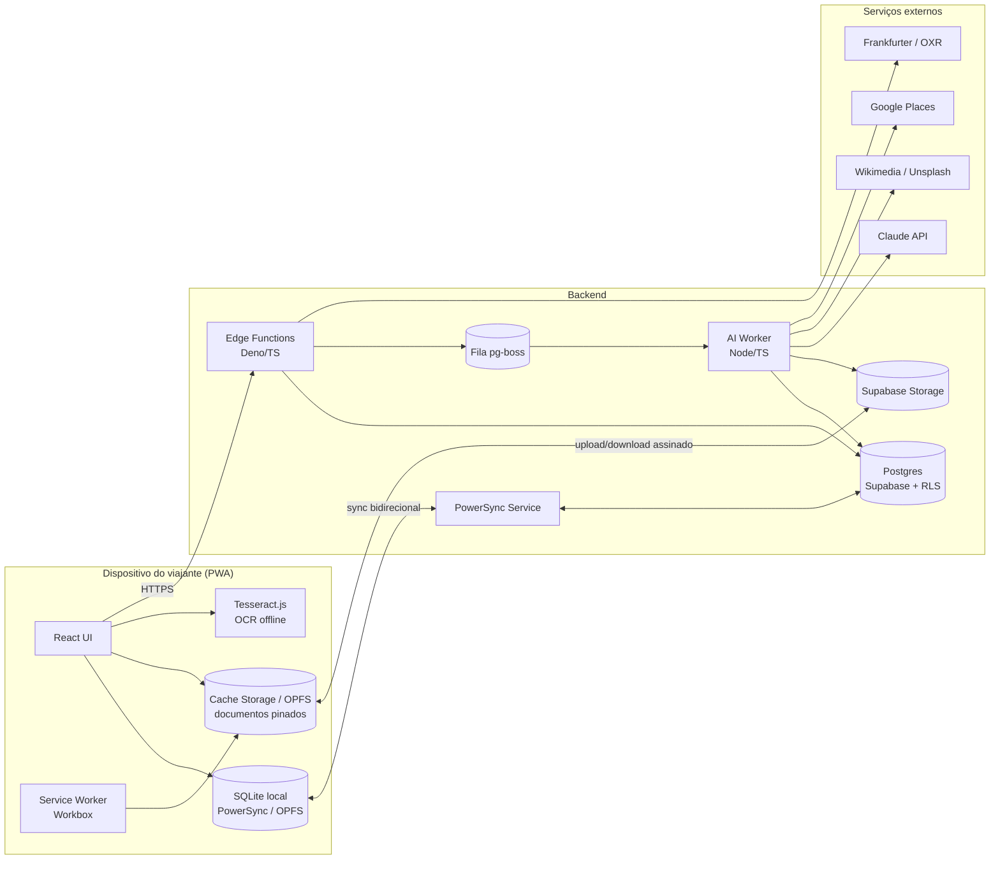
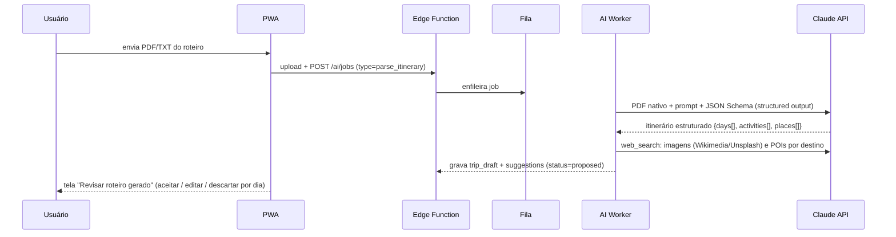

# 01 — Arquitetura de software e stack tecnológica

## 1. Decisões de arquitetura em uma página

| Preocupação | Decisão | Por quê |
|---|---|---|
| Tipo de aplicação | **PWA instalável (SPA)** com Service Worker, manifest e armazenamento local | Um único código para desktop e mobile; instalável sem loja; funciona offline; escape hatch para lojas via Capacitor se necessário |
| Frontend | **TypeScript + React 19 + Vite + vite-plugin-pwa (Workbox)** | Ecossistema maduro para PWA; Workbox resolve precache/runtime cache; Vite gera SW e manifest |
| Roteamento / estado servidor | **TanStack Router + TanStack Query** | Rotas tipadas; cache e retry de rede declarativos |
| Estado local / offline | **PowerSync (SQLite via wa-sqlite + OPFS) sincronizando com Postgres** | Banco relacional real no navegador, consultas SQL reativas, sync bidirecional com fila de escrita offline e resolução de conflito no servidor |
| UI | **Tailwind CSS + shadcn/ui (Radix)** | Acessibilidade nativa, componentes touch-friendly, tema claro/escuro |
| Backend | **Supabase** (Postgres + Auth + Storage + Edge Functions em Deno/TS) | Postgres com RLS resolve multiusuário; Storage assinado para arquivos; Edge Functions para chamadas a APIs externas sem expor chaves |
| Jobs assíncronos de IA | **Worker Node/TS separado** (Fastify) com fila **pg-boss** (Postgres) | OCR, parsing de roteiros e busca de imagens levam segundos/minutos; não podem rodar no request HTTP |
| IA generativa | **Claude API** (Anthropic SDK TS): `claude-opus-5` para parsing de roteiro e sugestões; `claude-haiku-4-5` para extrações simples em lote | Leitura nativa de PDF, *structured outputs* com JSON Schema, *web search* server-side, visão para recibos |
| OCR | **Camadas**: (1) Claude visão para recibos/vouchers (extração semântica: valor, moeda, data, estabelecimento); (2) **Tesseract.js** no dispositivo como fallback offline | Precisão semântica online; funcionamento mínimo sem rede |
| Câmbio | **Frankfurter (BCE, gratuito)** como fonte primária + **Open Exchange Rates** como fallback pago; tabela `fx_rates` cacheada diariamente e enviada ao dispositivo | Taxas disponíveis offline; cada gasto grava a taxa usada |
| Imagens de referência | **Wikimedia Commons API** (licença livre) + **Unsplash API** (atribuição) | Evita risco jurídico de "buscar no Google"; guarda autor/licença |
| Pontos de interesse | **Google Places API (New)** ou **OpenTripMap** como dado base; Claude ranqueia e contextualiza | Dados reais de POI; IA só agrega contexto, não inventa lugares |
| Mapas | Deep links Google Maps / Waze / Apple Maps + **MapLibre GL com tiles PMTiles** para visualização offline opcional | Links funcionam com o app nativo do usuário; mapa offline como evolução |
| Observabilidade | Sentry (web + worker) + OpenTelemetry nas Edge Functions | Erros de sync offline são difíceis de reproduzir; precisa de telemetria |
| Monorepo | **pnpm workspaces + Turborepo** | Compartilhar schemas Zod, tipos e regras de negócio entre web, edge functions e worker |

> **Alternativa mais enxuta**: se o time for pequeno e o multiusuário não for prioridade no início, trocar PowerSync por **Dexie.js + Dexie Cloud** reduz infraestrutura. Mantém-se o mesmo desenho de domínio.

## 2. Visão geral (diagrama)



## 3. Estratégia offline-first (o núcleo do produto)

### 3.1 Três camadas de dados, três estratégias

| Camada | O que é | Onde vive offline | Como sincroniza |
|---|---|---|---|
| **Dados estruturados** | viagens, dias, atividades, gastos, metadados de documentos, taxas de câmbio | SQLite local (PowerSync) | Sync contínuo; escritas offline entram em fila e são aplicadas no Postgres ao reconectar |
| **Arquivos** | PDFs, imagens, áudios | Cache Storage / OPFS, indexados por `sha256` | Download sob demanda + **pin por viagem** ("Preparar para offline"); upload via fila com retry e Background Sync onde disponível |
| **App shell** | HTML/JS/CSS, fontes, ícones | Precache do Workbox | Versionado no build; atualização com prompt "Nova versão disponível" |

### 3.2 Modo "Preparar para offline"

Antes da viagem, o usuário aciona **Preparar viagem para offline**. O app:

1. Calcula o tamanho total dos documentos vinculados a todos os dias da viagem.
2. Pede `navigator.storage.persist()` para evitar despejo do cache pelo navegador.
3. Baixa os arquivos em ordem de prioridade: documentos críticos (passagens, vouchers, seguros) → dias mais próximos → fotos/áudios.
4. Mostra progresso e o estado de cada dia (✔ completo, ◐ parcial, ✖ não baixado).
5. Grava um "snapshot de câmbio" para as moedas da viagem.

O estado de pin é por dispositivo (tabela local `asset_offline_state`) e nunca sobe ao servidor.

### 3.3 Regras de sincronização e conflito

- **Edição de campos de texto** (descrição do dia, notas): *last-writer-wins* por campo, com `updated_at` do dispositivo e log de versões para "desfazer".
- **Gastos**: inserção quase sempre; conflitos raros. Chave `client_id` (UUID v7) gerada no dispositivo garante idempotência do upload.
- **Ordem de atividades**: usar `position` fracionária (ex.: `0.5` entre `0` e `1`) evita reordenações em cascata no sync.
- **Exclusões**: soft delete (`deleted_at`) para que dispositivos offline reconciliem.

### 3.4 Limitações reais de PWA que o desenho já considera

| Limitação | Impacto | Mitigação |
|---|---|---|
| Safari iOS apaga storage de sites não visitados por 7 dias (ITP) | Documentos sumirem no meio da viagem | App **instalado na tela inicial** não sofre ITP; onboarding exige instalação antes de "Preparar offline"; `storage.persist()` |
| iOS não suporta Background Sync API | Uploads feitos offline só sobem quando o app abre | Fila de uploads própria executada no foreground + indicador "3 itens aguardando envio" |
| Cotas de armazenamento variam (≈ 50 MB a GBs) | Vídeos e fotos podem estourar | `storage.estimate()`; compressão de fotos no cliente (WebP, 2048px); vídeos ficam só na nuvem por padrão |
| Push limitado em iOS (só com app instalado, iOS ≥ 16.4) | Alertas de voo/lembretes | Notificações locais agendadas via SW quando instalado; e-mail/WhatsApp como canal alternativo |
| Sem acesso a arquivos do sistema | Importação de fotos | `<input capture>` e Web Share Target (compartilhar PDF de outro app direto para a viagem) |

## 4. Integração com IA (Módulo 4) e OCR (Módulo 3)

### 4.1 Pipeline de processamento de roteiro



Pontos de desenho:

- **Structured outputs** com JSON Schema garantem que o Claude devolva `days[]` com `date`, `title`, `narrative`, `activities[]`, `places[]` já no formato do banco. Nada de parsear texto livre.
- O worker roda com `thinking: {type: "adaptive"}` e `effort: "high"` para parsing de roteiro; `effort: "low"` e `claude-haiku-4-5` para classificação de documentos em lote.
- **Datas ausentes no esboço**: o modelo devolve `day_index` relativo (Dia 1, Dia 2) e a UI pede a data de início; o app calcula as datas.
- **Fuso horário por dia**: cada dia grava `timezone` (IANA). Voos que cruzam fusos são a principal fonte de erro em "dia corrente".
- Toda saída de IA vai para a tabela `ai_suggestions` com `status = proposed`; a UI de revisão é obrigatória. Isto satisfaz "IA sugere, o viajante decide".
- **Imagens**: o worker busca em Wikimedia Commons e Unsplash, grava `attribution` e `license`, e nunca faz *hotlink* (baixa para o Storage). Uma imagem por destino, com opção "trocar imagem".
- **Sugestões preditivas** (paradas, POIs): entrada = dias já estruturados + coordenadas de origem/destino; o worker consulta Google Places para candidatos reais dentro de um corredor da rota, e o Claude ranqueia e explica ("parada a 12 km do trajeto, aberta às terças, boa para almoço"). Sem dado base real, o modelo não sugere lugares.

### 4.2 Pipeline de OCR de recibos

1. Usuário fotografa o recibo pelo botão **+ Gasto** (câmera nativa, compressão no cliente).
2. **Online**: a imagem sobe ao Storage e uma Edge Function chama o Claude (visão) com *structured output* `{amount, currency, date, merchant, category_guess, confidence, line_items[]}`.
3. **Offline**: Tesseract.js roda no dispositivo, extrai o maior valor monetário e a moeda por regex; marca `source = ocr_offline` e `confidence` baixa; ao reconectar, o job online refina e a UI sugere "atualizar valores".
4. A UI apresenta um **card de sugestão de lançamento** com os campos preenchidos e destacados por confiança; um toque confirma, criando o `expense` vinculado ao documento e ao dia corrente.
5. O gasto grava `fx_rate` e `fx_rate_date` da tabela local `fx_rates`. O valor em moeda base fica congelado.

### 4.3 Câmbio

- Edge Function `fx-refresh` roda a cada 6 h (cron do Supabase), grava em `fx_rates(base, quote, date, rate, provider)`.
- O dispositivo sincroniza apenas as moedas das viagens ativas (regra de sync do PowerSync por `trip_currencies`).
- Na UI, cada valor mostra original + convertido; o relatório final agrupa por categoria/dia/moeda e permite recalcular com a **taxa do dia do gasto** (padrão) ou com a **taxa atual** (simulação).

## 5. Segurança e privacidade

- **RLS no Postgres**: toda tabela é filtrada por `trip_members(user_id, trip_id, role)`.
- **Arquivos**: URLs assinadas de curta duração; no dispositivo ficam no origin do app (isolado por navegador).
- **Documentos sensíveis (passaporte, seguro)**: campo `sensitive = true` habilita criptografia no cliente (WebCrypto AES-GCM, chave derivada da senha/passkey) antes do upload. O servidor nunca vê o conteúdo.
- **Chaves de APIs externas** só existem nas Edge Functions e no worker.
- **Dados enviados à IA**: PDF de roteiro e fotos de recibos; nunca documentos marcados como sensíveis. Política explícita na tela de consentimento.
- **Autenticação**: Supabase Auth com **passkeys** e magic link; sessão longa com refresh offline (token válido mesmo sem rede para abrir dados locais).

## 6. Estrutura do monorepo

```
turism/
├── apps/
│   ├── web/                # PWA (React + Vite + Workbox)
│   └── ai-worker/          # Fastify + pg-boss + Anthropic SDK
├── packages/
│   ├── domain/             # schemas Zod, tipos, regras (câmbio, "dia corrente", categorias)
│   ├── db/                 # migrations SQL, tipos gerados do Postgres, regras de sync
│   └── ui/                 # design system (Tailwind + shadcn)
├── supabase/
│   ├── functions/          # Edge Functions (fx-refresh, ocr-receipt, ai-jobs, share-target)
│   └── migrations/
└── docs/
```
