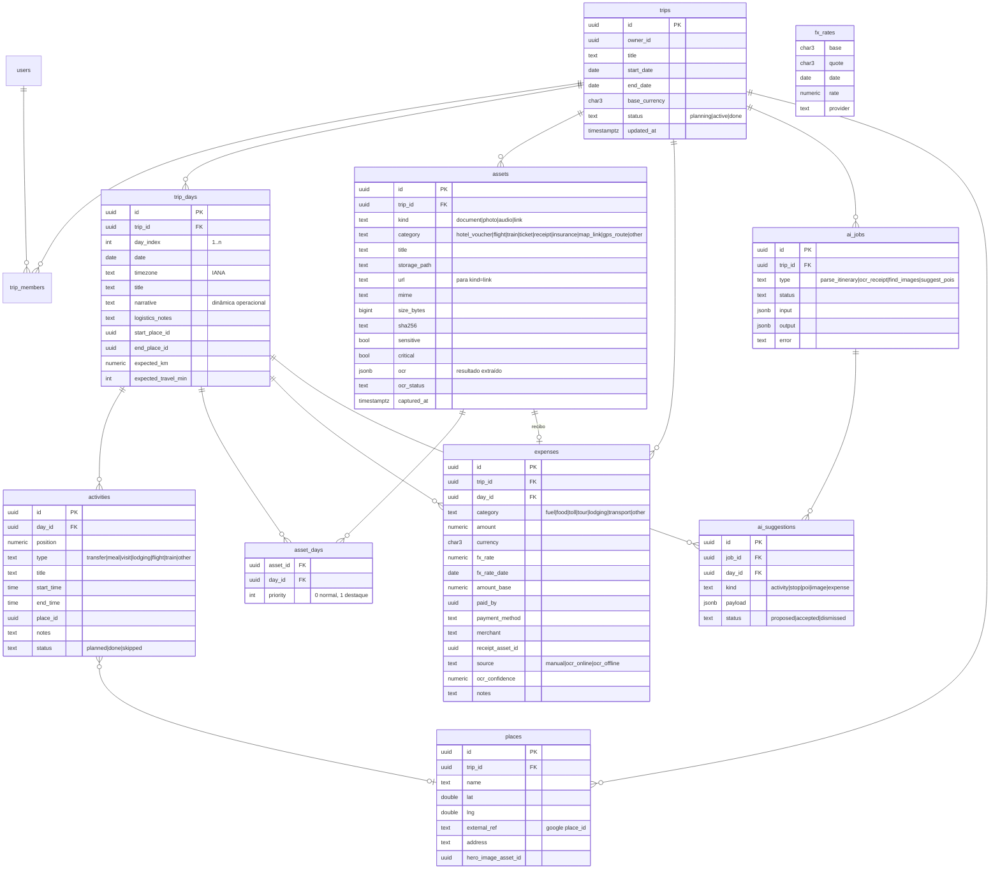

# 02 — Modelo de dados

Banco principal: **Postgres (Supabase)**. Réplica local: **SQLite (PowerSync)** com o mesmo esquema lógico, mais tabelas locais não sincronizadas (`asset_offline_state`, `upload_queue`).

## 1. Diagrama ER



## 2. DDL (Postgres) — tabelas principais

```sql
create extension if not exists "pgcrypto";

create table trips (
  id            uuid primary key default gen_random_uuid(),
  owner_id      uuid not null references auth.users(id),
  title         text not null,
  start_date    date,
  end_date      date,
  base_currency char(3) not null default 'BRL',
  status        text not null default 'planning' check (status in ('planning','active','done')),
  cover_asset_id uuid,
  created_at    timestamptz not null default now(),
  updated_at    timestamptz not null default now(),
  deleted_at    timestamptz
);

create table trip_members (
  trip_id  uuid references trips(id) on delete cascade,
  user_id  uuid references auth.users(id) on delete cascade,
  role     text not null default 'editor' check (role in ('owner','editor','viewer')),
  primary key (trip_id, user_id)
);

create table trip_days (
  id                  uuid primary key default gen_random_uuid(),
  trip_id             uuid not null references trips(id) on delete cascade,
  day_index           int  not null,
  date                date,
  timezone            text not null default 'America/Sao_Paulo',
  title               text,
  narrative           text,          -- descrição da dinâmica operacional do dia
  logistics_notes     text,          -- previsões de deslocamento
  start_place_id      uuid,
  end_place_id        uuid,
  expected_km         numeric(8,1),
  expected_travel_min int,
  updated_at          timestamptz not null default now(),
  deleted_at          timestamptz,
  unique (trip_id, day_index)
);

create table activities (
  id         uuid primary key default gen_random_uuid(),
  day_id     uuid not null references trip_days(id) on delete cascade,
  position   numeric not null,      -- ordenação fracionária, evita cascata no sync
  type       text not null default 'other',
  title      text not null,
  start_time time,
  end_time   time,
  place_id   uuid,
  notes      text,
  status     text not null default 'planned',
  updated_at timestamptz not null default now(),
  deleted_at timestamptz
);

create table assets (
  id           uuid primary key default gen_random_uuid(),
  trip_id      uuid not null references trips(id) on delete cascade,
  kind         text not null check (kind in ('document','photo','audio','link')),
  category     text not null default 'other',
  title        text not null,
  storage_path text,                -- null para links
  url          text,                -- para kind = 'link' (Google Maps, GPX remoto…)
  mime         text,
  size_bytes   bigint,
  sha256       text,
  sensitive    boolean not null default false,   -- criptografado no cliente
  critical     boolean not null default false,   -- prioridade no download offline
  ocr          jsonb,
  ocr_status   text not null default 'none' check (ocr_status in ('none','pending','done','failed')),
  captured_at  timestamptz,
  created_by   uuid,
  updated_at   timestamptz not null default now(),
  deleted_at   timestamptz
);

-- vínculo N:N documento ↔ dia ("tagueamento dinâmico")
create table asset_days (
  asset_id uuid references assets(id) on delete cascade,
  day_id   uuid references trip_days(id) on delete cascade,
  priority int not null default 0,
  primary key (asset_id, day_id)
);

create table fx_rates (
  base     char(3) not null,
  quote    char(3) not null,
  date     date    not null,
  rate     numeric(18,8) not null,
  provider text    not null,
  primary key (base, quote, date)
);

create table expenses (
  id               uuid primary key,             -- UUID v7 gerado no dispositivo (idempotência)
  trip_id          uuid not null references trips(id) on delete cascade,
  day_id           uuid references trip_days(id),
  category         text not null,
  amount           numeric(14,2) not null,
  currency         char(3) not null,
  fx_rate          numeric(18,8) not null,       -- taxa congelada no momento do lançamento
  fx_rate_date     date not null,
  amount_base      numeric(14,2) generated always as (round(amount * fx_rate, 2)) stored,
  paid_by          uuid,
  payment_method   text,
  merchant         text,
  receipt_asset_id uuid references assets(id),
  source           text not null default 'manual' check (source in ('manual','ocr_online','ocr_offline')),
  ocr_confidence   numeric(3,2),
  notes            text,
  spent_at         timestamptz not null default now(),
  updated_at       timestamptz not null default now(),
  deleted_at       timestamptz
);

create table places (
  id                  uuid primary key default gen_random_uuid(),
  trip_id             uuid not null references trips(id) on delete cascade,
  name                text not null,
  lat                 double precision,
  lng                 double precision,
  address             text,
  external_ref        text,          -- google place_id / osm id
  hero_image_asset_id uuid references assets(id),
  attribution         text,          -- autor/licença da imagem
  updated_at          timestamptz not null default now()
);

create table ai_jobs (
  id         uuid primary key default gen_random_uuid(),
  trip_id    uuid not null references trips(id) on delete cascade,
  type       text not null,
  status     text not null default 'queued' check (status in ('queued','running','done','failed')),
  input      jsonb not null,
  output     jsonb,
  error      text,
  created_at timestamptz not null default now(),
  updated_at timestamptz not null default now()
);

create table ai_suggestions (
  id         uuid primary key default gen_random_uuid(),
  job_id     uuid not null references ai_jobs(id) on delete cascade,
  trip_id    uuid not null references trips(id) on delete cascade,
  day_id     uuid references trip_days(id),
  kind       text not null,
  payload    jsonb not null,
  status     text not null default 'proposed' check (status in ('proposed','accepted','dismissed')),
  updated_at timestamptz not null default now()
);

-- Row Level Security: tudo passa por trip_members
alter table trips enable row level security;
create policy trips_member on trips
  using (exists (select 1 from trip_members m where m.trip_id = trips.id and m.user_id = auth.uid()));
-- (políticas análogas para trip_days, activities, assets, asset_days, expenses, places, ai_jobs, ai_suggestions)
```

## 3. Tabelas locais (somente no dispositivo, fora do sync)

```sql
create table asset_offline_state (
  asset_id   text primary key,
  state      text not null,        -- 'pinned' | 'downloaded' | 'failed' | 'evicted'
  bytes      integer,
  updated_at text
);

create table upload_queue (
  id          text primary key,    -- = assets.id
  local_blob  text,                -- chave no OPFS
  attempts    integer default 0,
  last_error  text,
  created_at  text
);
```

## 4. Regras de sync (PowerSync *sync rules*)

- Bucket `trip_<id>`: todas as tabelas filtradas por `trip_id`, apenas para viagens em que o usuário é membro.
- Bucket `fx_<currency>`: linhas de `fx_rates` das moedas presentes em `expenses` ou definidas na viagem; últimos 60 dias.
- Bucket `global`: categorias, preferências do usuário.
- Colunas `deleted_at` fazem parte do sync; a UI filtra `deleted_at is null`.

## 5. Consultas que sustentam a UX do dia

**Dia corrente** (calculado no dispositivo, respeitando o fuso do dia):

```sql
select * from trip_days
where trip_id = ? and deleted_at is null
order by abs(julianday(date) - julianday(date('now', 'localtime')))
limit 1;
```

**Documentos que "acendem" no dia** (destaque por prioridade, depois críticos, depois por categoria):

```sql
select a.*, ad.priority
from assets a
join asset_days ad on ad.asset_id = a.id
where ad.day_id = ? and a.deleted_at is null
order by ad.priority desc, a.critical desc, a.category, a.title;
```

**Resumo financeiro do dia** em moeda base:

```sql
select category, sum(amount_base) total
from expenses where day_id = ? and deleted_at is null
group by category;
```
